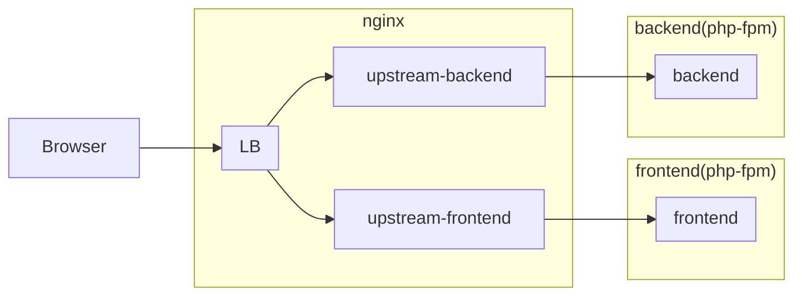

nginxでのパスベース振り分け検証
====================

nginxでパスベースでupstreamへの振り分け設定の検証

Requirement(必要なもの)
----------

* git
* docker
* bash


構成
----------

### nginx内server定義

|       名称        | ポート |                   用途                   |
| ----------------- | ------ | ---------------------------------------- |
| LB                | 80     | リバースプロキシ(LB)兼静的コンテンツ配信 |
| upstream-frontend | 8081   | php用upstream(for frontend)              |
| upstream-backend  | 8082   | php用upstream(for backend)               |

### 動作イメージ



### URL

|            URL            | 接続先(frontend) | 接続先(backend) |                備考                 |
| ------------------------- | :--------------: | :-------------: | ----------------------------------- |
| /frontend/                |        ✅         |        -        | frontendへ接続                      |
| /frontend/specially-path/ |        -         |        ✅        | frontend配下だが特別にbackendに接続 |
| /backend/                 |        -         |        ✅        | backendへ接続                       |
| /backend/specially-path/  |        ✅         |        -        | backend配下だが特別にfrontendに接続 |
| 上記以外                  |        ✅         |        -        | frontendへ接続                      |
| コンテンツが存在するパス  |        -         |        -        | nginx(80)がコンテンツリソースを返却 |

How To Use(使い方)
----------

### プロジェクト環境構築

初回一度だけ必要

```bash
./run.sh init
```

### プロジェクト環境破棄

関連するdockerリソースを全て削除します
composer install でインストールしたvendorファイルも削除します

```bash
./run.sh destroy
```

### run.shコマンドhelp

```bash
Usage:
  run.sh COMMAND [options]

COMMAND
  init               initialize development environment.
  up [options]       up docker containers. (= docker-compose up)
  down [options]     down docker containers. (= docker-compose down)
  destroy            destroy development environment. (docker containers, network, images, volumes, vendor/*)
  help               display help. (default)

TIPS
  undefined COMMAND are delegeted to docker-compose command.
  ex)
    run.sh ps  ==>  docker-compose ps
```
